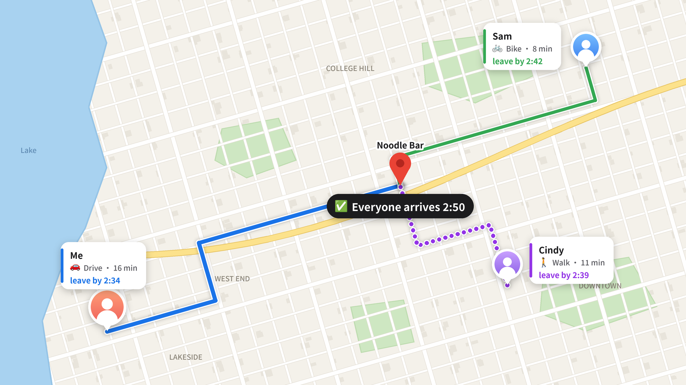

# Huddle

**The plan that actually happens.**

[Demo video](https://youtu.be/_h49PbVZYLw)

Built at **BigRed//Hacks 2026** (Cornell University), theme: **Navigation**.



---

## The problem

Group plans die in the group chat. Everyone has different preferences, budgets, and starting points, so the conversation stalls and nobody commits.

And someone usually ends up left out: the friend who lives far away and feels selfish asking to move the meetup, or the friend who can't afford the place everyone picked but doesn't want to say so in front of the group.

Huddle is a forcing function for actually getting together, built so that nobody is priced out or left behind.

## What Huddle does

1. **Start a plan.** Text Huddle `plan` and get a 4-character join code to share with friends. They text `join <code>` to join.
2. **Everyone answers privately.** Each person says how they're getting there (car, bike, walk, or rideshare), where they're starting from (a typed place or their live location), and what they want: "I'm starving," "no sushi," "I want to play pickleball," "back by 9."
3. **Huddle finds real options.** Once more than half the group says go, Huddle searches real places on Google, filters them by everyone's budget, opening hours, and travel limits, and ranks them for fairness.
4. **Vote.** Everyone replies A, B, or C. The majority wins.
5. **Everyone gets their own route.** Each person gets a private itinerary: when to leave, turn-by-turn directions from their own starting point in their own travel mode, a Google Maps link, and their estimated cost. Leave times differ; **everyone arrives at the same time.**
6. **On the day of.** A "heads up, leave in 5" nudge goes out before each person's leave time. If someone texts "running 10 min late," Huddle updates their arrival time and tells everyone else.

If people want very different things, like pickleball and boba, Huddle builds **combo plans** with a stop for each request, within walking distance of each other.

## See it in action

A two-person example (pickleball + boba):

```
Cindy:  plan
Huddle: let's do it 🎉 tell your friends to text me: join PUPG (say go when everyone's in)
Huddle: how're you getting there? 🚗 car, 🚲 bike, 🚶 walk, 🚕 uber, or neither
Cindy:  walk
Huddle: I have your live location near Olin Library 📍 use that, or text a different spot?
Cindy:  ya
Cindy:  I want to play pickleball                        [❤️]

Arnav (separately): join PUPG → bike → same → I want boba [👍]
Arnav:  go
Huddle → both: Arnav's ready ✅ (1/2 needed). say go when you're in too
Cindy:  ok that's all, where do we go now?

Huddle → both:
  ok here's what works for everyone 👇
  A: Teagle Hall + U Tea Bubble Tea — Pickleball + Boba · ≤11 min for everyone · $ · arrive together
  B: Noyes Fitness Center + Kung Fu Tea — Pickleball + Boba · ≤9 min for everyone · $ · arrive together
  reply A or B

Cindy: A    Arnav: A
Huddle → both: 🎉 it's A: Teagle Hall + U Tea Bubble Tea! everyone gets there around 2:50

Huddle → Cindy (private): your plan today: Teagle Hall … 🚶 leave by 2:39, about an 11 min walk
  then 🚶 ~4 min walk together to U Tea Bubble Tea
  [Google Maps card] you'll get there ~2:50
```

## Built with

| | |
|---|---|
| **[Photon](https://photon.codes) (Spectrum)** | The iMessage interface: messages, tapbacks, typing indicators, effects, and Find My live location. |
| **Google Gemini** | Turns messages like "no sushi" or "back by 9" into structured preferences. |
| **Google Places API** | Real venues near the group, and resolving typed starting points. |
| **Google Routes API** | Walking, biking, and driving times, with live traffic. OpenRouteService is the fallback. |
| **Capital One Nessie API** | Suggests a comfortable budget from a sandbox bank account's balance and spending. |
| **Python, FastAPI, SQLite** | The backend: conversation state, planning, the optimizer, and the web signup page. |
| **TypeScript on Bun** | A small bridge between Photon and the backend. |
| **Jinja2 + Tailwind CSS** | The signup page. |

## How it works

```
iPhone (iMessage) ⇄ Photon ⇄ Bridge (TypeScript/Bun)
                                   │  HTTP (localhost)
                                   ▼
                        Backend (Python/FastAPI)
   ├── conversation router    plain-word commands, onboarding
   ├── planning session       join codes, majority "go", poll, delivery, nudges
   ├── planning pipeline      extract → discover → route → optimize → poll
   ├── private vault          the only code that reads budgets and locations
   ├── privacy guard          checks every outgoing message
   └── SQLite                 + web signup page
```

When the group says go, the pipeline runs: **Gemini** turns messages into structured preferences, **Google Places** finds real open venues, **Google Routes** times each person's trip, and a pure-Python **optimizer** drops plans that break anyone's limits and ranks the rest for fairness, weighting the worst-off person as much as the group average. Everyone arrives at the same time; each person's leave time is that arrival minus their own travel time. Every external call degrades gracefully, and a record/replay cache lets the demo run offline.

Full design: [ARCHITECTURE.md](ARCHITECTURE.md).

## Privacy

Your budget, bank data, starting location, and requests are never shown to the group; they only see the plan, arrival time, and price tier. Gemini sees only pseudonymized preference messages, never names, numbers, budgets, or locations, and a privacy guard checks every outgoing message.

## Running it yourself

### Prerequisites

- macOS or Linux, Python 3.12, [uv](https://docs.astral.sh/uv/), and [Bun](https://bun.sh)
- API keys and accounts:
  - **Photon** project ID and secret (from the Photon dashboard)
  - **Google Cloud** API key with Places API (New) and Routes API enabled
  - **Gemini** API key (from Google AI Studio)
  - **Capital One Nessie** API key (from [nessieisreal.com](http://api.nessieisreal.com))
- Optional, to share the signup page publicly: [cloudflared](https://developers.cloudflare.com/cloudflare-one/connections/connect-networks/) or ngrok

### Setup

```bash
git clone TODO-repo-url
cd TODO-repo-folder
uv sync
cd bridge && bun install && cd ..
cp .env.example .env
```

Create the demo bank customers in the Nessie sandbox (once):

```bash
uv run python scripts/seed_nessie.py
```

### Environment variables

The essentials for the root `.env`:

| Variable | Value |
|---|---|
| `PROVIDER_MESSAGING` | `photon` (or `sim` to run without phones) |
| `PHOTON_PROJECT_ID`, `PHOTON_PROJECT_SECRET` | From the Photon dashboard |
| `PROVIDER_ROUTING` | `google` |
| `GOOGLE_PLACES_API_KEY` | Also used for Routes unless `GOOGLE_ROUTES_API_KEY` is set |
| `GEMINI_API_KEY` | From Google AI Studio |
| `NESSIE_API_KEY` | From the Nessie site |
| `CACHE_MODE` | `off`, `record`, or `replay` |

`bridge/.env` needs the same `PHOTON_PROJECT_ID` and `PHOTON_PROJECT_SECRET`. The full list of settings (ride-share pricing, timeouts, demo area, and more) is in [ARCHITECTURE.md §5](ARCHITECTURE.md#5-configuration). Never commit `.env`.

### Start it

Run each in its own terminal:

```bash
# 1. Backend — wait for "messaging=photon" in the startup log
uv run uvicorn app.main:app --port 8000

# 2. Bridge — wait for "connected to Photon Spectrum"
cd bridge && bun run src/index.ts

# 3. (Optional) public signup page through a tunnel
cloudflared tunnel --url http://localhost:8000
```

Then text the bot `hi` from a registered phone, or sign up at `http://localhost:8000/signup`. Only the signup pages are reachable through a tunnel; the webhook and other internal endpoints are blocked.

### Tests

```bash
uv run pytest
uv run ruff check .
```

The suite has about 450 tests, covering the optimizer and fairness scoring, synchronized arrival, budgets, preference extraction, the full conversation flow through the simulator, and privacy: attempted leaks through every kind of outgoing message, plus a check that only approved modules can read private data.

## Project structure

```
app/
├── api/            webhooks, simulator, health
├── conversation/   message routing, commands, all bot copy
├── onboarding/     setup questions, web signup claim
├── planning/       sessions, the pipeline, combo plans
├── optimizer/      feasibility, burden, fairness score, selection (pure Python)
├── private/        the vault and budget estimation
├── messaging/      outbound sending and the privacy guard
├── providers/      Photon, Gemini, Google, Nessie, ORS, record/replay cache
├── web/            signup pages (Jinja2 + Tailwind)
├── models/         Pydantic data models
└── db/             SQLite tables
bridge/             TypeScript relay between Photon and the backend
scripts/            Nessie seeding, demo scenario
tests/              the test suite
fixtures/           personas, test transcripts, recorded API responses
```

## Limits and what's next

- **Huddle in the group chat itself**, using a Photon dedicated line instead of join codes and DMs.
- **Public transit.** Bus routes aren't planned yet; Google already returns TCAT routes for Ithaca.
- **Ratings and learning.** Use venue ratings in ranking, and learn what each group liked after past hangouts.
- **Smarter running-late updates** that re-time everyone's routes, not just notify them.
- Current limits: USD and miles only, one timezone per deployment, Google can't tell members-only facilities (like university gyms) from public ones, and the backend needs an always-on machine (not serverless).

## Acknowledgments

Built at BigRed//Hacks 2026. Thanks to the organizers and to Photon, Capital One, and Google for the APIs that made Huddle possible.

